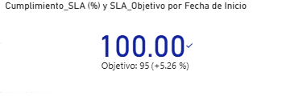
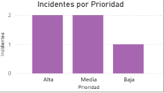
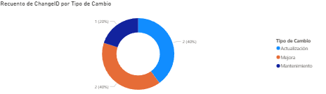

# ITSM Dashboard

Dashboard de **IT Service Management (ITSM)** usando **SQL Server**, **Python**, **Firebase** y **Power BI**.  
Permite visualizar y gestionar incidentes y cambios, cumpliendo con KPIs de SLA y tendencias temporales.

---

## 🚀 Tecnologías usadas

- **SQL Server** (Docker)
- **Python** (Faker + pyodbc + Flask)
- **Power BI**
- **Firebase** (autenticación opcional)
- **HTML / CSS / JS** para el frontend

---

## 🎯 Funcionalidades

- Visualización de **incidentes** por prioridad, estado y departamento.
- Visualización de **cambios** por tipo.
- Indicadores de **cumplimiento SLA**.
- Tendencias temporales de incidentes.
- Creación de incidencias desde la web.
- Login de usuarios con Firebase (opcional).

---

## 🖼️ Capturas

  
  
  

---

## 📁 Estructura del proyecto

├── screenshots/ # Capturas del dashboard
├── web/ # Aplicación web con Flask
│ ├── static/ # CSS, JS y assets
│ ├── templates/ # HTML
│ ├── app.py # Aplicación Flask
│ └── config.py # Configuración SQL y Firebase
├── Changes.csv # Datos de cambios
├── Incidents.csv # Datos de incidentes
├── config.env # Variables de entorno (.env)
├── populate_data.py # Script para poblar SQL Server
├── export_firestore.py # Exportación de datos a Firestore
├── docker-compose.yml # Levantar SQL Server
└── README.md

---

## ⚙️ Configuración

1. Crear archivo `.env` (o renombrar `config.env`) en la raíz de `web/`:

SQL_SERVER=127.0.0.1,1433
SQL_DATABASE=ITSM_Dashboard
SQL_USER=sa
SQL_PASSWORD=SuperClave!234
FIREBASE_JSON=serviceAccountKey.json
FIREBASE_API_KEY=tu_api_key_de_firebase

2. Configurar **Firebase**:  
   - Subir `serviceAccountKey.json` en la carpeta `web/`.  
   - Crear usuarios para login o usar los de prueba.  

3. Levantar **SQL Server** con Docker:

docker-compose up -d

4. Crear la base de datos y tablas si no existen (o usar `populate_data.py`):

python populate_data.py

5. Instalar dependencias de Python:

pip install -r requirements.txt

> Si no tienes `requirements.txt`, instalar manualmente:
pip install flask pyodbc python-dotenv firebase-admin requests

6. Iniciar la aplicación web:

cd web
python app.py

7. Abrir en el navegador: `http://127.0.0.1:5000`

---

## 🔐 Login

- Usar usuarios creados en Firebase.  
- Para pruebas rápidas, se pueden crear usuarios temporales con cualquier email y contraseña.

---

## 🎨 Frontend

- Diseño **responsive** con colores celestes degradados.
- Tabla de incidencias con **ordenamiento y búsqueda**.
- Formularios para crear nuevas incidencias con validación.

---

## 💡 Notas adicionales

- En producción, no usar el servidor de Flask incorporado; usar **Gunicorn** o similar.
- Personalizar la UI agregando más métricas o visualizaciones con Power BI.
- Para conectividad remota, configurar SQL Server para aceptar conexiones externas si es necesario.

---

## 📌 Créditos

Proyecto desarrollado por **Joao Basanta** como práctica de **Python, SQL Server y Dashboard ITSM**.
